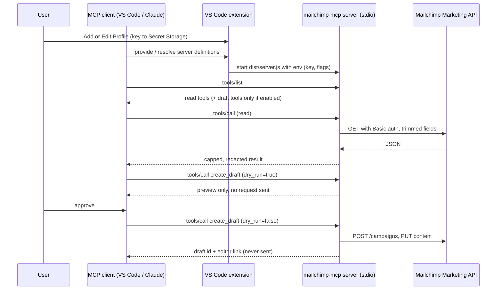

# Request flow

```mermaid
sequenceDiagram
    participant U as User
    participant C as MCP client (VS Code / Claude)
    participant E as VS Code extension
    participant S as mailchimp-mcp server (stdio)
    participant M as Mailchimp Marketing API

    U->>E: Add or Edit Profile (key to Secret Storage)
    C->>E: provide / resolve server definitions
    E->>S: start dist/server.js with env (key, flags)
    C->>S: tools/list
    S-->>C: read tools (+ draft tools only if enabled)
    C->>S: tools/call (read)
    S->>M: GET with Basic auth, trimmed fields
    M-->>S: JSON
    S-->>C: capped, redacted result
    C->>S: tools/call create_draft (dry_run=true)
    S-->>C: preview only, no request sent
    U->>C: approve
    C->>S: tools/call create_draft (dry_run=false)
    S->>M: POST /campaigns, PUT content
    S-->>C: draft id + editor link (never sent)
```
